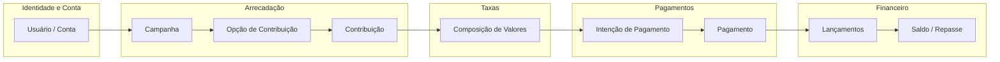

# Engine de intermediação financeira — modelagem DDD

Este documento descreve a **modelagem de domínio** da engine didática de intermediação financeira: visão do produto, **bounded contexts**, conceitos principais, fluxo ponta a ponta e regras de integração. O objetivo é qualquer desenvolvedor conseguir entender **o quê** a engine representa e **como** os contextos se relacionam, sem depender de detalhes de infraestrutura.

---

## 1. Visão do produto

A engine permite que **uma pessoa contribua dinheiro para outra**, enquanto a **plataforma cobra uma taxa** pelo processamento da operação.

**Exemplo canônico**

| Papel | Valor |
|--------|--------|
| Valor escolhido pelo contribuinte (destinado ao recebedor) | R$ 80,00 |
| Taxa da plataforma (paga pelo contribuinte) | R$ 4,00 |
| **Total cobrado do contribuinte** | **R$ 84,00** |
| Valor que o recebedor recebe (líquido da contribuição) | R$ 80,00 |
| Receita registrada da plataforma | R$ 4,00 |

**Regra de negócio explícita:** a taxa é **paga pelo contribuinte** (somada ao valor da contribuição no total a cobrar), e não descontada do recebedor neste modelo.

### 1.1 O que esta engine **não** é

- **Não** é um e-commerce tradicional: não há venda de produtos físicos como núcleo do domínio.
- Na experiência do produto podem existir metáforas de interface (“presente simbólico”, “rifa”, “convite”, “valor livre”), mas no **core** tudo isso se reduz a formas de **contribuição / arrecadação**.

---

## 2. Bounded contexts

Cada contexto tem **responsabilidades claras** e um **vocabulário** próprio. Contextos distintos **não** devem misturar entidades de domínio entre si; a comunicação ocorre por **identificadores**, **DTOs públicos** e **eventos**, com **casos de uso** orquestrando o que for necessário entre contextos.

### 2.1 Usuário

**Responsabilidade:** usuários autenticados que **administram campanhas**.

**Decisão de produto:** o **contribuinte não cria conta**, para reduzir fricção no fluxo de pagamento.

**Conceitos principais**

| Conceito | Papel no domínio |
|----------|------------------|
| Usuário | Identidade humana ou lógica no sistema |
| Conta | Agrupamento de permissões e recursos administrativos |
| Credenciais | Prova de identidade (login, tokens, etc.) |
| Perfil | Dados exibíveis ou configuráveis do usuário |
| Sessão | Estado autenticado em um período |
| Permissões | O que o usuário pode fazer (ex.: criar campanha) |

---

### 2.2 Arrecadação

**Responsabilidade:** **campanhas**, **opções de contribuição** e **contribuições** (o “o quê” e “quanto” se deseja contribuir antes do pagamento).

**Conceitos principais**

| Conceito | Papel no domínio |
|----------|------------------|
| Administrador(es) da Campanha | Quem configura a campanha (tipicamente ligado a Identidade e Conta; pode haver mais de um) |
| Recebedor | Quem deve receber o valor líquido (pessoa externa; histórico de recebedores com dados PIX em `recebedores`; saldo no Financeiro por `idCampanha` = `Campanha.id`) |
| Campanha | Container de arrecadação com regras e opções |
| Opção de Contribuição | Sacola por `tipo` (`presente`, `rifa`, `convite`) que agrupa itens |
| Contribuição | Item de arrecadação (`nome`, `valor`) criado pelo admin dentro de uma opção |
| Contribuinte Visitante | Quem paga, sem obrigatoriamente ter conta |
| Dados do Contribuinte | Informações associadas ao escolher um item (ex.: nome de exibição, email) |
| Status da Contribuição | `disponivel` (sem visitante) ou `indisponivel` (após associação) |

---

### 2.3 Taxas

**Responsabilidade:** **calcular a taxa** e montar a **composição de valores** que será usada pelo pagamento e pelo financeiro.

**Conceitos principais**

| Conceito | Papel no domínio |
|----------|------------------|
| Regra de Taxa | Política aplicável (percentual, fixo, faixas, etc.) |
| Cálculo de Taxa | Resultado do aplicativo da regra a um valor base |
| Composição de Valores | Quebra explícita: contribuição, taxa, total, destino ao recebedor |
| Valor da Contribuição | Montante “puro” destinado ao recebedor |
| Valor da Taxa | Montante da plataforma |
| Valor Total Pago | O que o contribuinte efetivamente desembolsa |
| Valor Destinado ao Recebedor | Líquido da contribuição para o recebedor |
| Responsável pela Taxa | Quem arca com a taxa no modelo (aqui: **contribuinte**) |

**Regra atual (documentada):**

- Valor da contribuição: R$ 80  
- Taxa: R$ 4  
- Total pago pelo contribuinte: R$ 84  
- Valor destinado ao recebedor: R$ 80  

---

### 2.4 Pagamentos

**Responsabilidade:** **cobrar o valor total** acordado na composição (integração com meios e provedores externos, em nível de domínio como “intenção” e “pagamento”).

**Conceitos principais**

| Conceito | Papel no domínio |
|----------|------------------|
| Intenção de Pagamento | Registro do valor e contexto mínimo para iniciar cobrança |
| Pagamento | Tentativa ou confirmação junto ao provedor |
| Método de Pagamento | Cartão, PIX, boleto, etc. |
| Provedor de Pagamento | Gateway ou adquirente |
| Transação Externa | ID e metadados no mundo externo |
| Status do Pagamento | Autorizado, capturado, falhou, estornado… |
| Evento de Pagamento | Notificação de mudança de estado (útil entre contextos) |

**Regra de modelagem importante**

- O contexto de **Pagamentos não conhece** “presente”, “rifa” ou “convite”.
- Pagamentos conhece apenas: uma **Contribuição** (referência), uma **Composição de Valores** e o **valor total a cobrar**.

Isso mantém o núcleo de cobrança **estável** enquanto a UX de arrecadação evolui.

---

### 2.5 Financeiro

**Responsabilidade:** registrar os **efeitos contábeis/financeiros** após pagamento aprovado: saldos, receita da plataforma, pendências e repasses.

**Conceitos principais**

| Conceito | Papel no domínio |
|----------|------------------|
| Lançamento Financeiro | Registro atômico de movimentação de valor |
| Saldo do Recebedor | Quanto o recebedor acumulou e pode resgatar |
| Receita da Plataforma | Taxas reconhecidas como receita |
| Valor Disponível | Liberado para resgate ou já alocado |
| Valor Pendente | Ainda não liquidado ou retido por regra |
| Resgate / Repasse | Saída de valor do sistema para o recebedor |
| Status do Repasse | Ciclo de vida do repasse |

---

## 3. Fluxo principal (ponta a ponta)

Ordem lógica dos passos, do ponto de vista do domínio:

1. **Administrador(es) da Campanha** criam uma **Campanha**.
2. A **Campanha** define um **Recebedor**.
3. A **Campanha** possui **Opções de Contribuição** (sacolas por tipo).
4. O **Administrador** cria **Contribuições** (itens, ex.: “fralda” R$ 80) dentro de uma opção.
5. **Contribuinte Visitante** escolhe um item e associa seus dados; a contribuição fica **indisponível** para outros.
6. **Taxas** calcula a taxa (ex.: R$ 4) e gera a **Composição de Valores**:
   - valor da contribuição: R$ 80  
   - taxa: R$ 4  
   - total pago: R$ 84  
   - valor destinado ao recebedor: R$ 80  
7. **Pagamentos** cria uma **Intenção de Pagamento** de R$ 84.
8. O **Pagamento** é aprovado.
9. **Financeiro** cria lançamentos, por exemplo:
   - R$ 80 → **Saldo do Recebedor**  
   - R$ 4 → **Receita da Plataforma**  
10. O **Recebedor** solicita **Resgate** ou **Repasse** (conforme regras do produto).

Diagrama simplificado (responsabilidades, não deployment):

---

## 4. Integração entre contextos (regras DDD)

- **Domínio:** cada contexto mantém seu modelo; **não** importar entidades de outro contexto dentro do núcleo de domínio.
- **Fronteiras:** troca de informação via **IDs**, **contratos públicos (DTOs)** e **eventos de domínio/aplicação** quando fizer sentido.
- **Orquestração:** **casos de uso** podem coordenar vários contextos (ex.: após criar contribuição, pedir composição de valores e criar intenção de pagamento).
- **Evolução:** começar com **implementações em memória** e adapters simples; integrações reais (banco dedicado, auth, gateway) entram de forma incremental, sem obliterar o modelo acima.

---

## 5. Princípios de implementação (alinhamento com o repositório)

Estes itens vêm do contrato de trabalho do projeto e reforçam como o código deve respeitar a modelagem:

- Linguagem de implementação: **TypeScript**.
- Organização: separar **domain**, **use-cases** e **adapters** (arquitetura hexagonal / ports and adapters).
- **Definition of Done** orientada a qualidade: checks do projeto (ex.: `pnpm check`) devem passar ao concluir incrementos.
- **Testes unitários** pequenos por regra de negócio.
- Priorizar **clareza e aprendizado** em relação a “completar tudo” de uma vez; evolução em **fases curtas**.

---

## 6. Glossário rápido (linguagem ubíqua)

| Termo | Significado nesta engine |
|--------|---------------------------|
| Contribuição | Item de arrecadação com valor; visitante associa dados ao reservar para pagamento |
| Opção de contribuição | Sacola por tipo de experiência; agrupa itens de contribuição |
| Composição de valores | Decomposição oficial: contribuição, taxa, total, destino ao recebedor |
| Intenção de pagamento | Passo explícito de cobrança com valor total (ex.: R$ 84) |
| Recebedor | Destinatário do valor líquido da contribuição |
| Taxa (paga pelo contribuinte) | Adicionada ao valor da contribuição no total a pagar |

---
