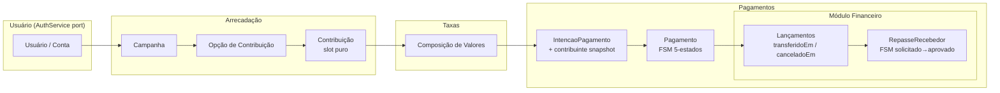

# Engine de intermediação financeira — modelagem DDD

Este documento descreve a **modelagem de domínio** da engine didática de intermediação financeira: visão do produto, **bounded contexts**, conceitos principais, fluxo ponta a ponta e regras de integração. O objetivo é qualquer desenvolvedor conseguir entender **o quê** a engine representa e **como** os contextos se relacionam, sem depender de detalhes de infraestrutura.

---

## 1. Visão do produto

A engine permite que **uma pessoa contribua dinheiro para outra**, enquanto a **plataforma cobra uma taxa** pelo processamento da operação.

**Exemplo canônico**

| Papel | Valor |
|--------|--------|
| Valor escolhido pelo contribuinte (destinado ao recebedor) | R$ 80,00 |
| Taxa da plataforma (paga pelo contribuinte) | R$ 4,00 |
| **Total cobrado do contribuinte** | **R$ 84,00** |
| Valor que o recebedor recebe (líquido da contribuição) | R$ 80,00 |
| Receita registrada da plataforma | R$ 4,00 |

**Regra de negócio explícita:** a taxa é **paga pelo contribuinte** (somada ao valor da contribuição no total a cobrar), e não descontada do recebedor neste modelo.

### 1.1 O que esta engine **não** é

- **Não** é um e-commerce tradicional: não há venda de produtos físicos como núcleo do domínio.
- Na experiência do produto podem existir metáforas de interface (“presente simbólico”, “rifa”, “convite”, “valor livre”), mas no **core** tudo isso se reduz a formas de **contribuição / arrecadação**.

---

## 2. Bounded contexts

Cada contexto tem **responsabilidades claras** e um **vocabulário** próprio. Contextos distintos **não** devem misturar entidades de domínio entre si; a comunicação ocorre por **identificadores**, **DTOs públicos** e **eventos**, com **casos de uso** orquestrando o que for necessário entre contextos.

A **Plataforma** (§2.6) é o BC fundacional **multi-tenant**: cada Usuário, Campanha, Sessão e regra de Taxa pertence a exatamente uma plataforma (eunenem, eucasei, ...). Os demais BCs referenciam-na por **mirror VO** (`IdPlataformaReferencia`) — o domínio deles nunca importa de `src/domain/plataforma/`. A regra é enforçada pelo `dependency-cruiser`.

### 2.1 Usuário

**Responsabilidade:** usuários autenticados que **administram campanhas**.

**Decisão de produto:** o **contribuinte não cria conta**, para reduzir fricção no fluxo de pagamento. O snapshot do contribuinte vive em `IntencaoPagamento.contribuinte` (BC Pagamentos), populado pelo webhook do provedor.

**Decisão arquitetural (Pattern A — Infrastructure Adapter, epic aperture-pgqih):** o domínio Usuário é **auth-implementation-agnostic**. Credencial, sessão, rate-limit e password-hashing **vivem fora do agregado**, atrás da porta `AuthService` (`src/adapters/usuario/auth-service.ts`). Dois adaptadores: `AuthServiceMemoria` (testes/dev, in-process) e `AuthServiceBetterAuth` (produção, BetterAuth + Postgres). A uniqueness composta `(idPlataforma, email)` é preservada em **duas camadas independentes** (schema do domínio + schema BetterAuth).

**Conceitos principais**

| Conceito | Papel no domínio |
|----------|------------------|
| Usuário | Identidade do administrador no sistema; carrega `idPlataforma` (multi-tenant) |
| Conta | Entidade aninhada 1:1 com Usuário; agrupa permissões e recursos administrativos |
| Perfil | Dados exibíveis (`nomeExibicao`, `slug` derivado para URLs públicas) |
| Permissões | O que a Conta pode fazer (ex.: criar campanha) |
| **AuthService (porta)** | Contrato para credencial + sessão; vive **fora** do agregado. Métodos: `criarConta`, `iniciarSessao`, `validarSessao`, `revogarSessao`, `alterarSenha`, `removerConta`. Cada um recebe `idPlataforma` para a composta. |
| **Sessão** | Owned pelo AuthService adapter (BetterAuth gerencia cookies + expiry em produção); o domínio só vê o resultado de `validarSessao` (`{idUsuario, idPlataforma, idConta} \| null`). |

---

### 2.2 Arrecadação

**Responsabilidade:** **campanhas**, **opções de contribuição** e **contribuições** (o "o quê" e "quanto" se deseja contribuir antes do pagamento).

**Mudança estrutural (Plan 0015):** `Contribuicao` virou *slot puro* — perdeu `status` enum e o snapshot do contribuinte. "Indisponibilidade" virou **predicado de consulta** sobre o BC Pagamentos (`EXISTS pagamento WHERE idContribuicao = X AND status = 'aprovado'`). O snapshot do contribuinte migrou para `IntencaoPagamento.contribuinte` no BC Pagamentos.

**Conceitos principais**

| Conceito | Papel no domínio |
|----------|------------------|
| Administrador(es) da Campanha | Quem configura a campanha (tipicamente ligado a Identidade e Conta; pode haver mais de um) |
| Recebedor | Quem deve receber o valor líquido (pessoa externa; histórico de recebedores com dados PIX em `recebedores`; saldo no módulo Financeiro por `idCampanha` = `Campanha.id`). Entidade versionada com `is_active`. |
| Campanha | Container de arrecadação com regras e opções |
| Opção de Contribuição | Sacola por `tipo` (`presente`, `rifa`, `convite`) que agrupa itens |
| Contribuição | **Slot puro** (pós-0015) — item de arrecadação (`nome`, `valor`, `imagemUrl`, `grupo`) criado pelo admin. **Sem estado armazenado**, sem snapshot de contribuinte. |
| Predicado "Indisponível" | Não é estado — é consulta. `EXISTS pagamento WHERE idContribuicao = X AND status = 'aprovado'`. Implementado em [`contribuicaoEstaIndisponivel`](src/use-cases/arrecadacao/contribuicao-esta-indisponivel.ts). |
| Contribuinte Visitante | Quem paga, sem conta. Os dados do visitante (nome, email, mensagem) **vivem em Pagamentos** desde o Plan 0015 — no `IntencaoPagamento.contribuinte`. |

---

### 2.3 Taxas

**Responsabilidade:** **calcular a taxa** e montar a **composição de valores** que será usada pelo pagamento e pelo financeiro.

**Conceitos principais**

| Conceito | Papel no domínio |
|----------|------------------|
| Regra de Taxa | Política aplicável (percentual, fixo, faixas, etc.) |
| Cálculo de Taxa | Resultado do aplicativo da regra a um valor base |
| Composição de Valores | Quebra explícita: contribuição, taxa, total, destino ao recebedor |
| Valor da Contribuição | Montante “puro” destinado ao recebedor |
| Valor da Taxa | Montante da plataforma |
| Valor Total Pago | O que o contribuinte efetivamente desembolsa |
| Valor Destinado ao Recebedor | Líquido da contribuição para o recebedor |
| Responsável pela Taxa | Quem arca com a taxa no modelo (aqui: **contribuinte**) |

**Regra atual (documentada):**

- Valor da contribuição: R$ 80  
- Taxa: R$ 4  
- Total pago pelo contribuinte: R$ 84  
- Valor destinado ao recebedor: R$ 80  

---

### 2.4 Pagamentos

**Responsabilidade:** **cobrar o valor total** acordado na composição (integração com provedores externos — Stripe, Pagarme, Fake), **arquivar a settlement do provedor**, e **carregar o snapshot do contribuinte** (introduzido pelo Plan 0015). Inclui o **módulo Financeiro** aninhado (§2.5) que registra os efeitos contábeis pós-aprovação.

**FSM de Pagamento (Plan 0015) — 5 estados:**

```
                 pendente
                    │
        ┌───────────┼───────────┐
        ▼           ▼           ▼
   processing   aprovado    rejeitado   (terminal)
        │           │
        │           ▼
        │       estornado    (terminal)
        ▼
  aprovado / rejeitado
```

- `pendente` — criação da intenção; sessão de checkout aberta no provedor.
- `processing` — PIX-only intermediate (`payment_intent.processing` — QR escaneado, banco ainda não confirmou).
- `aprovado` — settlement bem-sucedido. Dispara `registrarEfeitosFinanceirosPagamentoAprovado` no módulo Financeiro **na mesma transação DB**.
- `rejeitado` — falha pré-aprovação. Terminal.
- `estornado` — refund total via `charge.refunded`. Terminal. Cascateia `canceladoEm` nos lançamentos pendentes.

**Conceitos principais**

| Conceito | Papel no domínio |
|----------|------------------|
| Pagamento | Agregado raiz; carrega `IntencaoPagamento` + `TransacaoExterna` como entidades aninhadas; transita pelo FSM via webhooks. |
| IntencaoPagamento | Entidade aninhada: pré-auth + metadata do provedor (`externalRef` da sessão Stripe, `paymentIntentExternalRef` `pi_xxx`, `chargeExternalRef` `ch_xxx`) + **`contribuinte` (snapshot DadosContribuinte, nullable, populado via webhook `checkout.session.completed`)** + `balanceTransactionAvailableOn` (data de liberação Stripe, usada pelo Financeiro como gate de "marcar transferido"). |
| Método de Pagamento | `pix \| credit_card` |
| Provedor de Pagamento | Gateway atrás de porta `PagamentoProvider` (Stripe, Pagarme, Fake) |
| TransacaoExterna | Settlement do provedor: `aprovado \| rejeitado` (2-state), `statusBruto` do provedor para auditoria |
| Status do Pagamento | FSM 5-estados acima |
| DadosContribuinte | VO que **vive em Pagamentos** desde o Plan 0015 (anteriormente em Arrecadação). Re-export deprecado em arrecadação para soft migration. |

**Regra de modelagem importante**

- O contexto de **Pagamentos não conhece** "presente", "rifa" ou "convite".
- Pagamentos conhece: uma **Contribuição** (referência), uma **Composição de Valores**, **valor total a cobrar** e (pós-0015) o **snapshot do contribuinte** + **metadata do provedor**.

Isso mantém o núcleo de cobrança **estável** enquanto a UX de arrecadação evolui.

---

### 2.5 Módulo Financeiro (dentro de Pagamentos)

**Responsabilidade:** registrar os **efeitos contábeis/financeiros** após `Pagamento → aprovado`: saldos, receita da plataforma, lançamentos pendentes/transferidos/cancelados, e repasses ao recebedor.

**Por que módulo e não BC top-level (pós-Plan 0015):** falha o teste de independência de ciclo de vida — nenhum `LancamentoFinanceiro` existe sem um `Pagamento` que o causa, e a escrita é na **mesma transação DB** que aprova o pagamento. Não há "lifecycle financeiro" paralelo. Vive em `src/domain/pagamentos/financeiro/`.

**Mudança estrutural-chave (Plan 0015):** o FSM de `LancamentoFinanceiro` (`pendente | disponivel`) foi **eliminado**. As "fases" viraram predicados de consulta sobre **colunas de data observada**:

- `pending` → `transferidoEm IS NULL AND canceladoEm IS NULL`
- `transferred` → `transferidoEm IS NOT NULL AND canceladoEm IS NULL`
- `cancelado` → `canceladoEm IS NOT NULL`

**Datas observadas (o que de fato aconteceu)** substituem **enums preditivos (o que achávamos que ia acontecer)** — eliminou uma classe de race conditions cross-aggregate e simplificou idempotência.

**Conceitos principais**

| Conceito | Papel no domínio |
|----------|------------------|
| Lançamento Financeiro | Entidade sem FSM. Tipos: `credito_saldo_recebedor`, `credito_receita_plataforma`, `credito_passthrough_surcharge` (aperture-bjshv, sobretaxa de cartão repassada ao recebedor). Estado = predicado sobre `transferidoEm` / `canceladoEm`. |
| Saldo do Recebedor | View calculada via predicate sobre lançamentos de tipo `credito_saldo_recebedor` |
| Receita da Plataforma | View calculada sobre `credito_receita_plataforma` |
| RepasseRecebedor (raiz própria) | Agregado com FSM **2-state forward-only** (`solicitado → aprovado`, aperture-s03dr). `solicitadoEm` setado na criação; `aprovadoEm` setado na aprovação (carimba `transferidoEm = aprovadoEm` em todos os lançamentos linkados na mesma transação). `bankTransferRef` opcional para audit. |
| Status do Repasse | 2-state (`solicitado`, `aprovado`). Sem rejeição em v1. |
| Gate `balanceTransactionAvailableOn` | Lançamento só pode ser marcado `transferido` se `IntencaoPagamento.balanceTransactionAvailableOn ≤ now()`. Erro categórico distingue 3 razões: `pagamento_nao_aprovado`, `aguardando_liberacao_sem_data`, `aguardando_liberacao_ate`. |

---

### 2.6 Plataforma

**Responsabilidade:** definir a **fronteira multi-tenant** da engine. Cada plataforma (ex.: `eunenem`, `eucasei`) é um produto white-label rodando sobre a mesma engine, com sua própria base de usuários, suas próprias campanhas e sua própria política de taxas.

> Listada por último para preservar âncoras existentes, mas é o BC **fundacional** — todos os outros BCs trazem `IdPlataformaReferencia` (mirror VO) nas suas raízes e validam coerência multi-tenant nos casos de uso (`registrarContaUsuario`, `criarCampanha`, sagas de Checkout).

**Conceitos principais**

| Conceito | Papel no domínio |
|----------|------------------|
| Plataforma | Produto white-label; raiz do agregado (id, slug, nome) |
| Slug da Plataforma | Identificador legível e único (`eunenem`, `eucasei`, ...) usado em URLs e config |
| IdPlataformaReferencia | Mirror VO local em cada BC consumidor — evita acoplamento de domínio entre contextos |

**Estado atual (didático)**

- Ciclo de vida deferido — não há `criarPlataforma`/`suspenderPlataforma` como caso de uso público; as plataformas são **seedadas** (`PLATAFORMAS_SEED` em `repository.memory.ts`) com UUIDs determinísticos (`ID_PLATAFORMA_EUNENEM`, `ID_PLATAFORMA_EUCASEI`).
- Persistência apenas em memória; a porta `PlataformaRepository` expõe **somente leitura** (`findById`, `findBySlug`, `listAtivas`).
- Casos de uso de outros BCs que dependem de plataforma (ex.: cadastrar usuário, criar campanha) consultam `plataformaRepository.findById` como gate e lançam erro tipado próprio se a referência não existir.

---

### 2.7 Evento (supporting)

**Responsabilidade:** dados do **evento** ligado a uma campanha (tipo, data/hora, modalidade presencial/online, endereço opcional). Fora do core financeiro; não participa de Taxas, Pagamentos ou Financeiro.

**Conceitos principais (fase 1 — subdomínio Evento)**

| Conceito | Papel no domínio |
|----------|------------------|
| Evento | Agregado raiz; no máximo um por campanha (1:1 via `idCampanha`) |
| Tipo de Evento | `cha-bebe`, `cha-fraldas`, `cha-surpresa`, `cha-revelacao`, `batizado`, `aniversario` |
| Modalidade | `presencial` ou `online` |
| Data e Hora | Instante do evento (`Date`) |
| Endereço | Texto opcional |
| IdCampanha | Mirror VO local — não importa `Campanha` de Arrecadação |

**Planejado no mesmo BC (não implementado na fase 1)**

| Subdomínio | Relação |
|------------|---------|
| Convite | 1:1 com `IdEvento` — nome exibido, mensagem, personalização |
| Lista de Convidados | Por `IdEvento` — convidados, RSVP, link de confirmação |

**Integração:** `criarEvento` valida que a campanha existe via `CampanhaRepository`.

**Persistência (fase 1):** apenas `EventoRepositoryMemory`.

> Não confundir com `OpcaoContribuicao.tipo === 'convite'` em Arrecadação (sacola de contribuição) nem com `EventoPagamento` em Pagamentos.

---

## 3. Fluxo principal (ponta a ponta)

Ordem lógica dos passos pós-Plan 0015, do ponto de vista do domínio:

1. **Administrador(es) da Campanha** criam uma **Campanha** e registram um **Recebedor** (versionado em `recebedores`, com `is_active`).
2. A **Campanha** possui **Opções de Contribuição** (sacolas por `tipo`: `presente | rifa | convite`).
3. O **Administrador** cria **Contribuições** (slots: ex. "fralda" R$ 80) dentro de uma opção. Pós-0015: slots **não têm estado** — são definição pura.
4. **Contribuinte Visitante** escolhe um item e segue para checkout. Checkout valida (predicate `contribuicaoEstaIndisponivel`) que o slot não foi pago ainda — **sem reservar nada** (concorrência otimista).
5. **Taxas** calcula a taxa (ex.: R$ 4) e gera a **Composição de Valores**:
   - valor da contribuição: R$ 80
   - taxa: R$ 4
   - total pago: R$ 84
   - valor destinado ao recebedor: R$ 80
6. **Pagamentos** cria uma **`IntencaoPagamento`** + abre sessão de checkout no provedor (Stripe/Pagarme). Pagamento nasce `pendente`.
7. Provedor processa. Webhooks do provedor avançam o FSM:
   - PIX: `payment_intent.processing` → `processing` → `payment_intent.succeeded` → `aprovado`.
   - Cartão: `payment_intent.succeeded` → `aprovado`.
   - Falha em qualquer ponto: `pendente|processing → rejeitado`.
   - `checkout.session.completed` grava o **snapshot do contribuinte** (`nome`, `email`, mensagem) em `IntencaoPagamento.contribuinte`.
8. Quando o Pagamento vai a `aprovado`, o **módulo Financeiro** cria lançamentos **na mesma transação**:
   - R$ 80 → `credito_saldo_recebedor`
   - R$ 4 → `credito_receita_plataforma`
   - (opcional) sobretaxa → `credito_passthrough_surcharge`
9. Os lançamentos começam como **pending** (`transferidoEm IS NULL`); o admin marca `transferidoEm` quando o dinheiro é liberado pelo Stripe (gateado por `balanceTransactionAvailableOn`).
10. **Recebedor** solicita repasse → `RepasseRecebedor` em `solicitado`. **Admin** aprova → `aprovado` + carimbo de `transferidoEm` em todos os lançamentos linkados, atomicamente.

**Fluxo de exceção — estorno:** admin chama `estornarPagamento` em pagamento `aprovado` → dispara refund Stripe → `aprovado → estornado` → cascateia `canceladoEm = now()` em lançamentos linkados que ainda não foram transferidos. Lançamentos já transferidos **bloqueiam** o estorno.

Diagrama simplificado (responsabilidades, não deployment) — note Financeiro nested em Pagamentos:



---

## 4. Integração entre contextos (regras DDD)

- **Domínio:** cada contexto mantém seu modelo; **não** importar entidades de outro contexto dentro do núcleo de domínio. A regra é enforçada pelo `dependency-cruiser` (`.dependency-cruiser.cjs`), inclusive para o **mirror VO** `IdPlataformaReferencia` que cada BC consumidor define localmente.
- **Exceção arquitetural — módulo Financeiro:** vive em `src/domain/pagamentos/financeiro/` e importa livremente do agregado Pagamento. Não é fronteira de contexto; é organização de pastas dentro do mesmo BC. Vide §2.5 para a justificativa.
- **Fronteiras:** troca de informação via **IDs**, **contratos públicos (DTOs)** e **eventos de domínio/aplicação** quando fizer sentido.
- **Orquestração:** **casos de uso** podem coordenar vários contextos (ex.: validar campanha + checar predicado de indisponibilidade + calcular composição + criar intenção). Quando a coordenação envolve **múltiplos passos com efeitos colaterais cross-BC**, ela vive no pseudo-BC **Checkout** (`src/use-cases/checkout/`) — orquestração sem domínio próprio. Ver `CONTEXTS.md` § _Orquestração — Checkout_. **Pós-Plan 0015**, o padrão de "saga + compensação" simplificou-se: como Contribuição perdeu estado armazenado, o passo de criar a intenção é o último que importa — não há reserva de slot para desfazer. A única compensação real hoje é a **cascata de `canceladoEm`** dentro de `estornarPagamento` (atomicidade DB em vez de saga).
- **Padrão port-adapter para integração externa:** integrações com sistemas externos (provedor de pagamento, BetterAuth, e futuras integrações bancárias) seguem **Pattern A — Infrastructure Adapter**. O domínio define uma porta (interface) com vocabulário do domínio; um adapter em `src/adapters/<bc>/` implementa a porta contra o sistema externo. Exemplos canônicos: `PagamentoProvider` + `CheckoutSessionProvider` (Stripe/Pagarme/Fake) e `AuthService` (Memoria/BetterAuth). O agregado fica auth-implementation-agnostic / provider-agnostic; cada adapter pode trazer seu próprio schema/migration sem invadir o domínio.
- **Guard multi-tenant:** sagas e use-cases que recebem `idPlataforma` no input comparam-no com o `idPlataforma` carregado dos agregados referenciados (campanha, contribuição) e falham com erro tipado se houver mismatch (`CheckoutPlataformaMismatchError`). Esse é o gate cross-tenant explícito em código.
- **Evolução:** começar com **implementações em memória** e adapters simples; integrações reais (Postgres, BetterAuth, Stripe) entram de forma incremental atrás de portas, sem obliterar o modelo acima.

---

## 5. Princípios de implementação (alinhamento com o repositório)

Estes itens vêm do contrato de trabalho do projeto e reforçam como o código deve respeitar a modelagem:

- Linguagem de implementação: **TypeScript**.
- Organização: separar **domain**, **use-cases** e **adapters** (arquitetura hexagonal / ports and adapters).
- **Definition of Done** orientada a qualidade: checks do projeto (ex.: `pnpm check`) devem passar ao concluir incrementos.
- **Testes unitários** pequenos por regra de negócio.
- Priorizar **clareza e aprendizado** em relação a “completar tudo” de uma vez; evolução em **fases curtas**.

---

## 6. Glossário rápido (linguagem ubíqua)

| Termo | Significado nesta engine |
|--------|---------------------------|
| Contribuição | Slot de arrecadação com valor; pós-Plan 0015 é **definição pura** — sem estado armazenado, sem snapshot do contribuinte |
| Opção de contribuição | Sacola por tipo de experiência; agrupa contribuições |
| Composição de valores | Decomposição oficial: contribuição, taxa, total, destino ao recebedor |
| Intenção de pagamento | Pré-auth no provedor; carrega `externalRef` da sessão Stripe, metadata do FSM, **e o snapshot do contribuinte** (populado por webhook) |
| Snapshot do contribuinte | `DadosContribuinte` (nome, email, mensagem) gravado em `IntencaoPagamento.contribuinte` quando o `checkout.session.completed` chega. Pós-0015 vive em Pagamentos, não em Arrecadação |
| Recebedor | Destinatário do valor líquido da contribuição; entidade versionada com `is_active` |
| Taxa (paga pelo contribuinte) | Adicionada ao valor da contribuição no total a pagar |
| FSM de Pagamento | 5 estados: `pendente → processing → aprovado → estornado` (e `→ rejeitado` como terminal alternativo) |
| Predicado "indisponível" | Consulta `EXISTS pagamento WHERE idContribuicao = X AND status = 'aprovado'`; **não** é estado armazenado pós-0015 |
| Data observada (Plan 0015) | `transferidoEm` / `canceladoEm` em `LancamentoFinanceiro`. **Datas que de fato aconteceram** substituem **enums preditivos** — pendente/transferido/cancelado viraram predicados sobre essas colunas |
| Módulo Financeiro | Pasta `src/domain/pagamentos/financeiro/` aninhada no BC Pagamentos. Não é BC top-level — não passa no teste de independência de ciclo de vida |
| Repasse (FSM 2-state) | `RepasseRecebedor`: `solicitado → aprovado`, forward-only. Aprovação carimba `transferidoEm` em lançamentos linkados atomicamente |
| AuthService (porta) | Contrato de credencial + sessão **fora** do agregado Usuário. Adapters: `Memoria` (testes/dev), `BetterAuth` (produção, Postgres-backed) |

---
